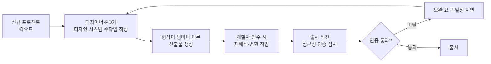

# PCD-001 — 다제품 라인에서 디자인 시스템 작성·검증 비용이 프로젝트마다 반복되어 출시 일정과 접근성 인증이 위협받는다

- 작성일: 2026-05-12
- 작성자: 유혜원
- 상태: Active
- 이슈키: XDS-001

> **TL;DR** 자이닉스가 4개 제품 라인을 동시 운영하면서 디자이너·PD가 신규 프로젝트마다 디자인 시스템을 손으로 작성해 1~2주를 소비하고, 산출물 형식 불일치로 개발 인수 재작업과 접근성 인증 보완 요구가 반복된다. 디자인 의도를 입력하면 표준 산출물과 접근성 검증을 자동 산출하는 도구로 전환해 비용과 인증 리스크를 동시에 해소한다.

## 이 문서가 묻는 결정

- [x] **방향 합의**: 디자인 시스템을 *문서로 직접 작성*하는 모델에서 *도구로 생성*하는 모델로 전환할 것인가? — 추천: 전환
- [x] **접근성 강제 수준**: WCAG 2.2 AA 만 강제 vs. WCAG 2.2 AA + KWCAG 2.2 둘 다 강제 — 결정: 둘 다 강제 (교육·공공 제품 법적 의무)
- [x] **다국어 1차 범위**: 한국어 단독 시작 vs. 다국어 확장 구조만 깔아두기 — 결정: 다국어 확장 구조만 깔아두기

## 트레이드오프 / 대안

- **대안 A: 기존 디자인 시스템(Ant Design/MUI 등) 직접 채택** — 학습 곡선 낮으나, 자이닉스 4개 제품 라인의 도메인 특화 컴포넌트(LMS의 진도 위젯, AI의 채팅 풍선 등)와 한국어/KWCAG 컨텍스트가 부재해 결과적으로 매 프로젝트 커스터마이즈 비용은 동일하게 발생.
- **대안 B: 디자인 시스템 문서를 Confluence/Notion 템플릿화** — 작성 비용 일부 절감하나, 산출물 표준화·접근성 자동 검증·개발자 코드 인수 자동화 부재. 결국 출시 직전 접근성 인증 보완 요구는 그대로 발생.
- **선택지(본 PCD): 디자인 시스템 생성 도구 도입** — 초기 도구 구축 공수가 크지만(약 3~4개월), 도입 후 신규 프로젝트당 디자인 시스템 작성 비용 1~2주 → 1~2시간으로 단축. 접근성 검증이 생성 단계에 포함되어 인증 보완 요구 사후 발생 가능성 구조적으로 차단.

## 공개 질문

- 도구의 v1.0 이후 운영 책임자(거버넌스 오너) 미정.
- 향후 자이닉스 외 서브 브랜드 또는 외부 협력사가 본 디자인 시스템을 공유받게 될 가능성 — 멀티테넌트 요구 발생 시점 미정.

---

## 1. Trigger

2026년 5월, AICMS 어드민·차세대 LMS·AI 학습 도구 등 신규 프로젝트가 동시에 킥오프를 앞두고 있다는 보고와, 직전 3개 프로젝트(2024~2026)에서 디자인 시스템 작성 공수 평균 9.6일, 출시 직전 접근성 인증 보완 요구 3건 발생이 누적 집계되었다[^1]. 이를 계기로 "디자인 시스템 생성을 도구화하자"는 제안이 디자인·PD 조직 내부에서 제기되었다.

## 2. Context

자이닉스는 교육 도메인을 중심으로 LMS·AICMS·B2B 어드민·AI 학습 도구·B2C 마케팅 페이지 등 성격이 다른 4개 제품 라인을 동시 운영한다. 각 제품의 사용자(학습자·교강사·학교 관리자·내부 운영자)와 컨텍스트(가독성 중심 학습 화면, 데이터 밀도 높은 어드민, AI 결과 카드 등)가 달라, 단일 디자인 시스템을 그대로 적용하기 어렵다.

각 프로젝트 시작 시점에 디자이너·PD가 디자인 토큰·컴포넌트 명세·UX 가이드를 손으로 작성하고, 작성 결과물의 형식(파일 종류·이름·구성)이 팀·시점마다 달라 개발자가 인수받을 때 매번 다른 형태로 흡수·변환해야 한다. 작성 과정에서 접근성(WCAG 2.2 AA 및 한국 KWCAG 2.2) 검증이 명시적 단계로 박혀있지 않아 출시 직전 인증 심사에서 색상 대비비·키보드 흐름·포커스 가시성 미달이 반복 적발되고, 이로 인해 출시 일정 지연과 추가 보완 비용이 발생한다[^2].

교육·공공 영역 제품(LMS·AICMS)은 정보통신접근성 인증 의무 대상이며, 미인증 상태로는 공공기관·대학 납품이 제한된다[^3]. 한편 국제·다국어 시장 진입 가능성도 거론되고 있어 영어·일본어 등 추가 언어 확장 여지를 디자인 시스템 차원에서 미리 확보해두어야 한다.

## 3. Problem

**디자이너·PD가 신규 프로젝트 킥오프 시점에 디자인 시스템을 처음부터 손으로 작성하면서 1~2주를 소비하고, 그동안 개발팀은 디자인 산출물이 도착하기 전까지 컴포넌트 구현을 시작하지 못하거나 임시 디자인으로 시작해 추후 재작업이 발생한다.** 4개 제품 라인이 동시 진행될 때 이 비용은 곱연산으로 누적되어 회사 전체 신제품 출시 속도를 제약한다.

**산출물 형식이 작성자·시점마다 달라 개발자가 인수받을 때 매번 다른 형태로 해석·변환해야 한다.** 어떤 프로젝트는 Figma 파일 하나로, 어떤 프로젝트는 Notion 문서로, 어떤 프로젝트는 Sketch + 별도 PDF로 전달되어, 개발자는 디자인 의도를 코드 토큰으로 옮기는 *번역* 작업에 시간을 소모한다. 이 번역 과정에서 색상·간격·반경 값이 누락되거나 임의 해석되어 디자인-구현 간 불일치가 발생하고, QA 단계에서 시각 회귀(visual regression) 결함이 반복 제기된다.

**디자인 시스템 작성 중 접근성 검증이 명시적 단계로 포함되어 있지 않아, 출시 직전 정보통신접근성 인증 심사에서 색상 대비비 미달·키보드 포커스 가시성 누락·스크린리더 레이블 부재 등 동일 유형의 미달 사항이 반복적으로 적발된다.** 적발 시점이 늦어 보완에 들어가는 비용이 크고, 교육·공공 도메인 제품(LMS·AICMS)은 인증 미달 상태로 공공기관·대학 납품 절차에 진입할 수 없어 출시 일정과 매출 인식이 직접적으로 지연된다.

## 4. Solution Direction

**디자인 시스템을 *문서로 직접 작성하는* 모델에서 *도구가 생성하는* 모델로 전환한다.** 디자이너·PD가 도구 안에서 프로젝트의 디자인 의도(시각 톤·강조 색·모서리 강도·데이터 밀도·도메인 컨텍스트)를 선택·조정하면, 도구가 표준 포맷의 디자인 시스템 산출물 묶음(토큰·컴포넌트 명세·UX 가이드·접근성 보고서)을 자동으로 생성한다. 작성자의 결정 영역은 *디자인 의도*에 집중되고, 표준화·문서화·접근성 검증은 도구가 책임진다.

**산출물은 모든 제품 라인·모든 작성자에게 동일한 형식으로 통일한다.** 개발자는 도구가 생성한 표준 산출물을 추가 해석 없이 그대로 인수할 수 있어, 디자인-구현 간 번역 비용과 시각 회귀 결함이 구조적으로 감소한다.

**접근성 검증을 산출물 생성 단계에 자동으로 포함시켜, 출시 전 단계에 인증 미달 상태에 도달하지 않도록 한다.** WCAG 2.2 AA와 KWCAG 2.2를 동시 강제하여, 교육·공공 도메인의 법적 의무와 국제적 접근성 기준을 한 번에 충족한다. 생성된 디자인 시스템 자체가 인증 심사 준비 산출물의 일부가 되어 보완 요구 사후 발생 가능성을 구조적으로 차단한다.

**4개 제품 라인이 공통 기반을 공유하면서도 라인별 고유 경험을 일관되게 표현할 수 있어야 하며, 다국어 진입 시 디자인 체계를 처음부터 다시 구축하지 않아도 된다.** 한국어 단독으로 시작하는 단계부터 향후 영어·일본어 등 추가 언어 시장 진입 가능성까지 회사 차원의 디자인 결정이 누적 자산으로 남도록 한다.

**디자인 결정의 경위와 책임 소재가 언제든 확인 가능해야 리브랜딩·감사·정책 변경에 대응할 수 있다.** 본 도구로 만들어지는 모든 디자인 시스템이 *왜 그렇게 결정되었는지*에 대한 근거를 회사가 잃지 않도록 한다.

## 5. 다루지 않는 것 (Out of Scope)

- 도구의 구체적 기능 분해·화면 구성·데이터 모델 — FRD/Spec의 영역.
- 도구가 채택할 기술 스택·렌더링 매체·인증 방식 — FRD/Spec의 영역.
- 도구가 생성하는 디자인 시스템의 *실제 토큰 값과 컴포넌트 스타일* — 도구 v0.1 이후 본 도구를 통해 생산되는 산출물 차원.
- 자이닉스 브랜드 가이드라인 자체의 개정 — 별도 브랜드 거버넌스 차원.

---

[^1]: 출처 — 2024~2026년 신규 프로젝트 3건(가칭 P-A, P-B, P-C)의 킥오프 보고서 및 출시 사후 회고. 디자인 시스템 작성 공수 평균 9.6일, 인증 보완 요구 3건은 PMO 통합 일지 기준.

[^2]: 출처 — 2025년 하반기 디자인-개발 합동 회고 기록(가칭 RP-25H2). "산출물 형식 불일치로 인한 추가 작업"이 디자이너·개발자 양측 회고 상위 항목으로 동일 언급.

[^3]: 출처 — 국가정보화 기본법 제32조 및 정보통신접근성 인증제도 운영지침. LMS·AICMS 등 교육·공공 영역 SaaS는 인증 의무 또는 공공조달 사실상 요건.