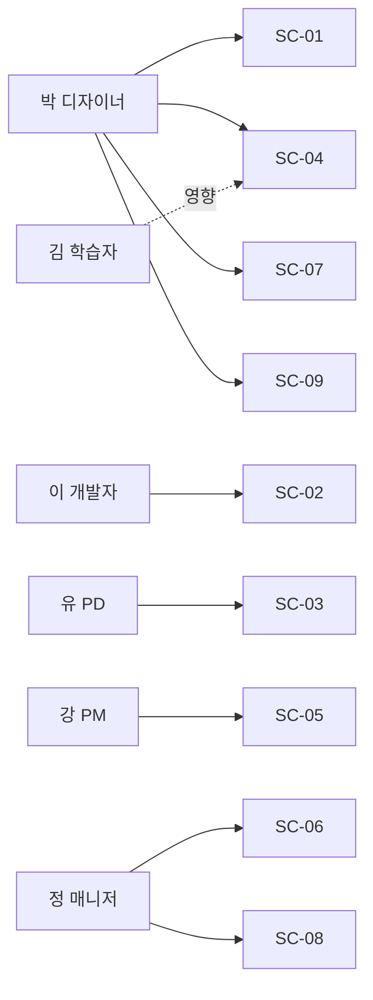

# USD — XDS-001 (디자인 시스템 생성 도구) 사용자 시나리오 정의서

- 최초 작성일: 2026-05-12
- 마지막 갱신: 2026-05-12
- 이슈키: XDS-001

> **TL;DR** 사용자 유형 6종(직접 5종 + 간접 1종), 페르소나 6명, 시나리오 P0=4개·P1=3개·P2=2개. 도구의 직접 사용자(디자이너·PD·개발자·운영자·PM)와 산출물 영향을 받는 최종 사용자가 모두 반영됨.

## 이 문서가 묻는 결정

- [x] **최종 사용자(엔드유저)를 USD에 포함할 것인가** — 결정: 포함. 도구를 직접 사용하지 않지만 도구가 생성한 디자인 시스템의 영향을 직접 받는 핵심 이해관계자이므로, 접근성·가독성 검증 시나리오의 평가 기준 페르소나로 등장시킴.
- [x] **PM·디자인 시스템 오너 분리 여부** — 결정: 분리. 일정 관리(PM) vs. 거버넌스 결정(오너)는 책임이 달라 동일 페르소나로 묶을 수 없음.

## 공개 질문

- 자이닉스 외부 협력사 디자이너가 본 도구를 사용하는 시나리오는 v1.0 이후 별도 검토 필요. 현재 USD는 사내 사용자만 다룸.

---

## 1. 사용자 유형

도구에 직접 관여하는 5종과 간접 영향을 받는 1종.

**직접 사용자 (도구를 조작하는 사람)**

- **디자인 시스템 오너** — 회사 디자인 거버넌스 책임자. 회사 차원 토큰·원칙 결정, 변경 승인.
- **디자이너** — 프로젝트별 시각 디자인 결정자. 스타일 프리셋 선택, Seed Token 조정, 컴포넌트 시각 변형.
- **프로덕트 디자이너(PD/기획자)** — 프로젝트별 UX 결정자. 컴포넌트 사용 패턴·작업 흐름·콘텐츠 가이드 정의.
- **개발자** — 도구가 생성한 산출물을 코드에 흡수하는 소비자. 토큰·컴포넌트 명세를 코드 구현으로 연결.
- **프로젝트 매니저(PM)** — 다제품 라인의 디자인 시스템 작업 진척·인수 일정 조율.

**간접 사용자 (도구가 만든 산출물의 영향을 받는 사람)**

- **최종 사용자(엔드유저)** — 디자인 시스템이 적용된 제품을 실제로 사용하는 학습자·교강사·학교 운영자·일반 시민. 도구를 직접 조작하지 않지만, 도구가 강제하는 접근성 기준과 한국어 가독성 결정의 직접 수혜자(또는 피해자).

## 2. 페르소나

| ID | 이름 | 사용자 유형 | 목표 | Pain Point | 사용 맥락 | 상태 |
|---|---|---|---|---|---|---|
| P-01 | 정 매니저 | 디자인 시스템 오너 | 회사 4개 제품 라인의 디자인 일관성과 접근성 인증 통과율을 회사 차원에서 유지 | 프로젝트별 디자인 결정을 사후 합의로만 따라가게 되어 회사 차원 표준이 실질적으로 작동하지 않음[^1] | 분기별 디자인 회의·인증 심사 대응·신규 프로젝트 검토 시 도구 사용 | active |
| P-02 | 박 디자이너 | 디자이너 | 신규 AI 학습 도구 프로젝트의 디자인 시스템을 1~2시간 안에 정리해 개발팀에 인수 | 매번 토큰·컴포넌트 명세를 처음부터 작성하면서 1~2주를 소비, 그 사이 다른 프로젝트 일정이 밀림[^2] | 신규 프로젝트 킥오프 직후 집중 사용, 이후 변경 시 산발적 사용 | active |
| P-03 | 유 PD | 프로덕트 디자이너 | LMS 차세대 버전의 UX 패턴(빈 상태·온보딩·진도 표현)을 디자인 시스템에 표준화 | 프로젝트 종료 후 PD가 정리한 UX 패턴이 다음 프로젝트에 전수되지 않고 매번 재발견됨[^3] | 프로젝트 진행 중 패턴 발견 시점, 회고 시점에 사용 | active |
| P-04 | 이 개발자 | 개발자 | 디자이너가 인수한 산출물을 추가 해석 없이 코드 토큰·컴포넌트로 옮김 | 인수 산출물의 형식이 프로젝트마다 달라 토큰 값 누락·임의 해석을 매번 거쳐야 하고, QA에서 시각 회귀 결함 반복 제기됨[^4] | 인수 시점, 컴포넌트 구현 중 토큰 조회 시점 | active |
| P-05 | 강 PM | 프로젝트 매니저 | 4개 제품 라인 동시 진행 시 디자인 시스템 작업 진척과 개발 인수 일정을 조율 | 디자인 시스템 작성 완료 시점이 작성자마다 들쭉날쭉해 개발 인수 일정을 일정 직전에야 확정할 수 있음[^5] | 주간 일정 회의, 인수 게이트 시점 | active |
| P-06 | 김 학습자 | 최종 사용자(대표) | 모바일에서 LMS 강의를 시각 보조 기능(고대비 모드·스크린리더)을 켠 상태로 수강 | 색상 대비비 미달·키보드 포커스 실종·라벨 누락으로 강의 진행이 중단되거나 학습 평가 응시 불가[^6] | 평일 저녁 모바일 학습, 주 3~5회 | active |

## 3. 핵심 시나리오

### SC-01 — 디자이너가 신규 프로젝트의 디자인 시스템을 생성한다

- 우선순위: P0
- 상태: hypothesis
- 관련 페르소나: P-02 박 디자이너

사용자 흐름:

1. 박 디자이너가 도구에 접속해 새 프로젝트를 만든다.
2. 프로젝트 유형(B2B 어드민/LMS/AI/B2C)을 선택한다.
3. 사용할 스타일 프리셋을 선택한다(예: shadcn-like + Glass 액센트).
4. 강조 색·모서리 강도·데이터 밀도 등 핵심 디자인 의도를 조정한다.
5. 도구 화면에서 5개 핵심 컴포넌트의 프리뷰로 톤을 즉시 확인한다.
6. 전체 컴포넌트 목록을 펼쳐 모든 컴포넌트의 변형을 검토한다.
7. 도구가 표시하는 접근성 점검 결과를 확인하고, 미달 항목이 있으면 색 조정으로 해소한다.
8. 산출물 묶음을 export하여 개발팀에 인수한다.

### SC-02 — 개발자가 도구가 생성한 산출물을 인수해 코드에 반영한다

- 우선순위: P0
- 상태: hypothesis
- 관련 페르소나: P-04 이 개발자

사용자 흐름:

1. 이 개발자가 디자이너가 공유한 산출물 묶음을 받는다.
2. 토큰 파일과 컴포넌트 명세서를 자신의 프로젝트 리포에 가져온다.
3. 컴포넌트 명세서에서 부품 구성·변형·상태·접근성 요구를 확인하며 구현한다.
4. 구현 중 의문이 생기면 명세서의 결정 근거(어떤 디자인 의도에서 비롯되었는지)를 함께 확인한다.
5. 디자인 시스템 새 버전이 배포되면 변경분만 자신의 리포에 반영한다.

### SC-03 — PD가 발견한 UX 패턴을 디자인 시스템에 추가한다

- 우선순위: P0
- 상태: hypothesis
- 관련 페르소나: P-03 유 PD

사용자 흐름:

1. 유 PD가 LMS 진행 중 새로운 UX 패턴(예: 진도 80% 시 격려 메시지)을 발견한다.
2. 도구에서 해당 프로젝트를 열어 UX 가이드 영역으로 이동한다.
3. 패턴 카드를 추가하고 사용 케이스·사용하지 말아야 할 케이스·예시 화면을 정리한다.
4. 회사 차원 표준으로 격상해야 한다고 판단되면 디자인 시스템 오너에게 승격 검토를 요청한다.

### SC-04 — 박 디자이너가 접근성 점검 결과를 검토해 미달 항목을 해소한다

- 우선순위: P0
- 상태: hypothesis
- 관련 페르소나: P-02 박 디자이너 (조작), P-06 김 학습자 (영향)

사용자 흐름:

1. 박 디자이너가 토큰을 조정한 직후 접근성 점검 결과를 화면에서 확인한다.
2. WCAG 2.2 AA와 KWCAG 2.2 두 기준 모두에 대해 항목별 통과·미달 상태를 점검한다.
3. 미달 항목(예: 본문 색상 대비비 3.8:1)을 발견하면 제안된 보정값을 적용하거나 직접 색을 재조정한다.
4. 모든 항목이 통과 상태가 된 후 export 단계로 진입한다.
5. 박 디자이너가 export를 완료하면, 이후 김 학습자가 고대비 모드·스크린리더·키보드로도 LMS 강의를 끊김 없이 수강할 수 있다.

### SC-05 — PM이 다제품 라인의 디자인 시스템 작업 진척을 확인한다

- 우선순위: P1
- 상태: hypothesis
- 관련 페르소나: P-05 강 PM

사용자 흐름:

1. 강 PM이 도구의 작업 로그·진척 대시보드를 연다.
2. 프로젝트별로 디자인 시스템 작성·검증·인수 상태를 한 화면에서 확인한다.
3. 인수 임박 프로젝트의 미해결 접근성 미달 항목을 파악하고 디자이너에게 알린다.
4. 다음 주 인수 가능 프로젝트와 지연 가능 프로젝트를 분류해 주간 일정에 반영한다.

### SC-06 — 디자인 시스템 오너가 회사 차원 토큰 변경을 승인·전파한다

- 우선순위: P1
- 상태: hypothesis
- 관련 페르소나: P-01 정 매니저

사용자 흐름:

1. 정 매니저가 디자이너로부터 회사 표준 토큰 변경 제안을 받는다(예: 본문 색상 한 단계 어둡게).
2. 도구에서 변경이 4개 제품 라인 각각에 미치는 영향을 미리보기로 확인한다.
3. 영향이 우려되는 프로젝트가 있으면 해당 PD·디자이너와 협의 후 결정한다.
4. 승인 후 회사 표준 토큰을 갱신하면 각 프로젝트가 새 표준을 따를지 결정하는 알림을 받는다.

### SC-07 — 디자이너가 기존 프로젝트의 디자인 시스템을 새 버전으로 업데이트한다

- 우선순위: P1
- 상태: hypothesis
- 관련 페르소나: P-02 박 디자이너

사용자 흐름:

1. 박 디자이너가 회사 표준 토큰이 갱신되었다는 알림을 받는다.
2. 자신의 프로젝트를 열어 현재 사용 중인 토큰과 새 표준의 차이를 비교한다.
3. 받아들일 변경을 선택해 자신의 프로젝트에 반영하고, 받아들이지 않을 변경은 잠금 처리한다.
4. 새 버전의 산출물을 export해 개발팀에 변경분을 인수한다.

### SC-08 — 다국어 추가가 디자인 시스템 재작성 없이 확장된다

- 우선순위: P2
- 상태: hypothesis
- 관련 페르소나: P-01 정 매니저

사용자 흐름:

1. 정 매니저가 자이닉스 LMS의 영어 시장 진입 결정 통보를 받는다.
2. 도구에서 LMS 프로젝트의 언어 설정에 영어를 추가한다.
3. 한국어 본문 가독성 토큰(자간·행간)이 영어용으로 자동 매핑된 결과를 확인한다.
4. 영어용 폰트 스택과 길이 변화(영문 평균 70% 길이)에 따른 컴포넌트 변형을 검토·승인한다.

### SC-09 — 자연어 톤 설명에서 AI가 시드 디자인을 제안한다

- 우선순위: P2
- 상태: hypothesis
- 관련 페르소나: P-02 박 디자이너

사용자 흐름:

1. 박 디자이너가 새 AI 학습 도구의 톤을 "차분하고 신뢰감 있는, 다크 모드 우선"으로 묘사하는 텍스트를 입력한다.
2. 도구가 제안하는 강조 색·모서리 강도·폰트 후보 3종을 검토한다.
3. 가장 가까운 후보를 베이스로 선택해 수동 조정으로 다듬는다.
4. AI 제안 사용 사실이 산출물에 라벨로 기록되어 사후 검토 시점에 참고된다.

## 4. 비스코프 / 한계

- 자이닉스 외부 협력사 디자이너가 이 도구를 사용하는 시나리오는 v1.0 이후 별도 검토.
- 최종 사용자(P-06)는 도구를 직접 조작하지 않으므로 페르소나 P-06은 SC-04에서 *영향을 받는 대상*으로만 등장한다.

## 변경 이력

| 날짜 | 변경 내용 | 변경자 |
|---|---|---|
| 2026-05-12 | 초기 작성 — 사용자 유형 6종, 페르소나 6명, 시나리오 9개(P0=4, P1=3, P2=2) | 유혜원 |

---

[^1]: Pain Point 근거 — 2025년 하반기 디자인 거버넌스 회의 기록(가칭 DG-25H2). "표준이 합의되었으나 실제 프로젝트에서 따라가지 않는다"는 정 매니저 본인의 회고 발언 기반. 현재는 가설 단계로, 도입 후 인터뷰로 검증 필요.

[^2]: Pain Point 근거 — PCD-001 문서 내 각주 1과 동일 출처. 2024~2026년 3개 프로젝트 평균 9.6일 작성 공수 통계.

[^3]: Pain Point 근거 — 가설. 2025년 LMS·AICMS 프로젝트 회고에서 "이전 프로젝트에서 정리된 패턴이 다음 프로젝트 시작 시점에 흩어져 있어 재발견했다"는 PD 회고 다수 발언(정량 데이터 부재 — 도입 후 검증 필요).

[^4]: Pain Point 근거 — PCD-001 문서 내 각주 2와 동일 출처. 2025년 디자인-개발 합동 회고 RP-25H2.

[^5]: Pain Point 근거 — 가설. 2026년 1분기 PM 인터뷰(예정). 현재는 PM 측면 정량 데이터 부재 — 도입 전 사전 인터뷰 1회 필요.

[^6]: Pain Point 근거 — PCD-001 문서 내 각주 3 및 정보통신접근성 인증 심사 보완 요구 3건의 적발 항목 분석. 김 학습자는 시각 보조 기능 사용자의 대표 페르소나로, 인증 심사 미달 항목이 직접적으로 사용 차단을 야기함이 확인됨.