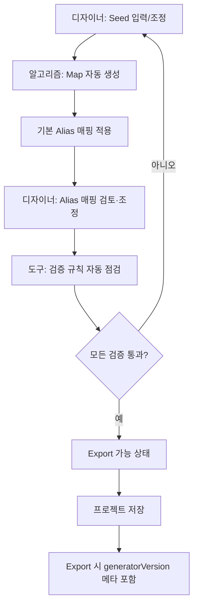

# Token Schema — XDS-001 디자인 토큰 데이터 모델 명세

- 작성일: 2026-05-12
- 작성자: 유혜원
- 상태: Draft v0.1
- 이슈키: XDS-001
- 참조: PRD §3 C1·C2·C3, §4.5

> **TL;DR** 도구가 다루는 디자인 토큰의 데이터 모델. W3C Design Tokens Format을 채택하고, Ant Design의 Seed→Map→Alias 3계층 명명을 결합. 토큰 카테고리 11종, 색상 11단 스케일(OKLCH 기반 자동 파생), 다크모드는 `_dark` 조건 분기, 다국어는 `_locale` 조건 분기. 도메인 컴포넌트 anatomy는 Bones 위 별도 레이어(Domain Layer)로 분리.

## 이 문서가 묻는 결정

- [x] **포맷 표준**: W3C Design Tokens Community Group Format 채택 — 결정
- [x] **3계층 명명**: Seed → Map → Alias — 결정
- [x] **색공간**: OKLCH (인지적 균일성, 자동 대비비 계산 친화적) — 결정
- [x] **다크모드 전략**: 알고리즘 자동 파생 + 수동 override 가능 (override 우선) — 결정
- [x] **계층 구조**: Bones(공통) + Skin(프로젝트 시각) + Domain(프로젝트 도메인) 3층 — 결정
- [ ] **OKLCH → HEX 폴백**: 구형 브라우저에서 OKLCH 미지원 시 HEX 폴백 자동 생성 여부 — *공개 질문*

---

## 1. 표준·포맷

### 1.1 W3C Design Tokens Format

토큰 1개의 기본 형태:

```json
{
  "$value": "토큰 값",
  "$type": "color | dimension | fontFamily | …",
  "$description": "한국어 설명",
  "$extensions": {
    "xds.derived": true,
    "xds.locked": false,
    "xds.source": "algorithm | manual | imported"
  }
}
```

규칙:
- `$value`는 리터럴 또는 다른 토큰 참조 `{path.to.token}`
- `$type`은 W3C 표준 타입 + XDS 확장 타입 (예: `xds.elevation`)
- `$description`은 *왜 이 토큰이 있는지*를 디자이너·개발자 모두 이해할 수 있는 한국어 한 줄
- `$extensions.xds.*`는 도구 내부에서 사용하는 메타 (파생 여부·잠금 여부·출처)

### 1.2 strict-tokens 모드

도구가 export하는 모든 컴포넌트 명세에 다음 규칙 적용:
- 컴포넌트는 *토큰만* 참조 가능, 리터럴(예: `#1677FF`, `12px`) 직접 사용 금지
- 위반 시 도구가 빨간 경고, Export 차단
- 예외: prototype·실험 상태 토큰은 `$extensions.xds.experimental: true`로 명시

---

## 2. 3계층 (Bones 안에서의 토큰 위계)

```
Seed Token (사람이 결정)
   ↓ 알고리즘 파생
Map Token (자동 생성)
   ↓ 의미 매핑
Alias Token (컴포넌트가 참조)
```

### 2.1 Seed Token

**디자이너가 직접 결정하는 소수의 입력값**.

| 토큰 키 | 타입 | 예시 값 | 설명 |
|---|---|---|---|
| `seed.color.primary` | color | `oklch(0.55 0.18 250)` | 주요 액션·강조 |
| `seed.color.success` | color | `oklch(0.65 0.17 145)` | 성공·완료 |
| `seed.color.warning` | color | `oklch(0.78 0.15 75)` | 주의 |
| `seed.color.error` | color | `oklch(0.55 0.22 25)` | 위험·오류 |
| `seed.color.info` | color | `oklch(0.55 0.18 250)` | 정보 (기본 primary와 동일) |
| `seed.color.bgBase` | color | `oklch(1 0 0)` | 페이지 배경 |
| `seed.color.textBase` | color | `oklch(0.15 0 0)` | 본문 텍스트 |
| `seed.borderRadius` | dimension | `6` | 모서리 반경 기본값 (px) |
| `seed.fontSize` | dimension | `14` | 본문 기본 크기 (px) |
| `seed.fontFamily` | fontFamily | `["Pretendard", "system-ui"]` | 본문 폰트 스택 |
| `seed.spacingBase` | dimension | `4` | spacing 스케일 단위 |
| `seed.density` | xds.density | `default` | `compact \| default \| comfortable` |
| `seed.wireframe` | boolean | `false` | 와이어프레임 모드 |

**규칙**:
- Seed 토큰은 디자이너 1회 결정으로 끝, 이후 Map·Alias는 자동
- 디자이너가 Seed를 변경하면 Map·Alias 전체가 다시 계산됨
- Seed 토큰 자체는 컴포넌트가 직접 참조하지 않음 (컴포넌트는 Alias만 참조)

### 2.2 Map Token

**Seed에서 알고리즘으로 자동 생성되는 스케일·변형**.

#### 2.2.1 색상 11단 스케일

각 시맨틱 색(`primary`, `success`, `warning`, `error`, `info`, `neutral`)에 대해 50·100·200·300·400·500·600·700·800·900·950 단계 자동 생성.

```
map.color.primary.50   ← 가장 밝음 (배경용)
map.color.primary.100
…
map.color.primary.500  ← Seed 원본 또는 가장 가까운 단계
…
map.color.primary.950  ← 가장 어두움 (텍스트용)
```

**생성 알고리즘** (의사 코드):
```
function generateScale(seedColor: OKLCH) {
  // OKLCH 명도(L)를 11단계로 분포
  // L=0.97(50), 0.93(100), ..., 0.55(500=seed), ..., 0.15(900), 0.10(950)
  // 채도(C)는 양 끝에서 점진 감소 (200~800에서 최대)
  // 색조(H)는 유지 (단, 50~100에서 미세 조정 — 인지적 자연스러움)
  return [...]
}
```

#### 2.2.2 시맨틱 상태 변형

각 시맨틱 색에 대해 4단계 상태 변형 (Ant Design의 hover/active 변형 차용):

```
map.color.primary.bg          ← {primary.50} (호버 영역 배경)
map.color.primary.bgHover     ← {primary.100}
map.color.primary.border      ← {primary.200}
map.color.primary.borderHover ← {primary.300}
map.color.primary.hover       ← {primary.400}
map.color.primary.default     ← {primary.500} (메인 사용)
map.color.primary.active      ← {primary.600}
map.color.primary.text        ← {primary.700}
map.color.primary.textHover   ← {primary.600}
map.color.primary.textActive  ← {primary.800}
```

#### 2.2.3 사이즈 스케일

`seed.spacingBase` (기본 4)를 베이스로 한 8단계:

```
map.size.xxs = base × 1   (4)
map.size.xs  = base × 2   (8)
map.size.sm  = base × 3   (12)
map.size.md  = base × 4   (16)
map.size.lg  = base × 5   (20)
map.size.xl  = base × 6   (24)
map.size.xxl = base × 8   (32)
map.size.xxxl = base × 12 (48)
```

#### 2.2.4 모서리 반경 스케일

`seed.borderRadius` (기본 6)를 베이스:

```
map.radius.none = 0
map.radius.xs   = base × 0.33  (2)
map.radius.sm   = base × 0.67  (4)
map.radius.md   = base × 1     (6)  ← seed
map.radius.lg   = base × 1.33  (8)
map.radius.xl   = base × 2     (12)
map.radius.full = 9999
```

#### 2.2.5 타이포 스케일

`seed.fontSize` (기본 14)를 베이스로 한 7단계 + 위계:

```
map.font.size.xs   = base × 0.857  (12)
map.font.size.sm   = base × 1      (14)  ← seed body
map.font.size.md   = base × 1.143  (16)
map.font.size.lg   = base × 1.286  (18)
map.font.size.xl   = base × 1.429  (20)
map.font.size.xxl  = base × 1.714  (24)
map.font.size.xxxl = base × 2.286  (32)

map.font.lineHeight.tight  = 1.25
map.font.lineHeight.normal = 1.5
map.font.lineHeight.loose  = 1.75
map.font.lineHeight.korean = 1.6  ← 한국어 본문 가독성 토큰 (KWCAG 반영)

map.font.letterSpacing.tight  = -0.02em
map.font.letterSpacing.normal = 0
map.font.letterSpacing.korean = -0.01em  ← 한국어 본문 자간
```

### 2.3 Alias Token

**컴포넌트가 실제 참조하는 의미 토큰**. Map 토큰을 참조하는 별칭.

| Alias 토큰 | 참조 | 용도 |
|---|---|---|
| `alias.text.body` | `{map.color.neutral.900}` | 본문 텍스트 |
| `alias.text.heading` | `{map.color.neutral.950}` | 헤더 텍스트 |
| `alias.text.caption` | `{map.color.neutral.600}` | 보조 텍스트 |
| `alias.text.disabled` | `{map.color.neutral.400}` | 비활성 텍스트 |
| `alias.text.link` | `{map.color.primary.default}` | 링크 |
| `alias.surface.base` | `{map.color.neutral.50}` | 페이지 배경 |
| `alias.surface.elevated` | `{map.color.neutral.0}` | 카드·모달 배경 |
| `alias.surface.muted` | `{map.color.neutral.100}` | 부드러운 영역 |
| `alias.border.subtle` | `{map.color.neutral.200}` | 옅은 경계선 |
| `alias.border.default` | `{map.color.neutral.300}` | 일반 경계선 |
| `alias.border.strong` | `{map.color.neutral.500}` | 강조 경계선 |
| `alias.action.primary` | `{map.color.primary.default}` | 주요 버튼 배경 |
| `alias.action.danger` | `{map.color.error.default}` | 위험 액션 |
| `alias.feedback.success` | `{map.color.success.default}` | 성공 상태 |
| `alias.feedback.warning` | `{map.color.warning.default}` | 경고 상태 |
| `alias.feedback.error` | `{map.color.error.default}` | 오류 상태 |
| `alias.feedback.info` | `{map.color.info.default}` | 정보 상태 |
| `alias.text.onPrimary` | `{map.color.neutral.0}` | primary 배경 위 텍스트 |
| `alias.text.onDanger` | `{map.color.neutral.0}` | danger 배경 위 텍스트 |
| `alias.control.height.sm` | `24` | 작은 컨트롤 높이 |
| `alias.control.height.md` | `32` | 기본 컨트롤 높이 |
| `alias.control.height.lg` | `40` | 큰 컨트롤 높이 |
| `alias.control.padding.x` | `{map.size.sm}` | 컨트롤 좌우 padding |
| `alias.focus.ring.width` | `2` | 포커스 링 굵기 (WCAG 강제) |
| `alias.focus.ring.color` | `{map.color.primary.400}` | 포커스 링 색 |
| `alias.focus.ring.offset` | `2` | 포커스 링 오프셋 |

**규칙**:
- 모든 컴포넌트 명세는 Alias만 참조
- Alias 추가는 도구 운영자 권한 (디자이너가 임의 추가 불가, v0.3+)
- Alias가 Map을 참조하지 않고 리터럴을 갖는 경우는 금지 (반드시 Map 토큰을 가리킴)

---

## 3. 토큰 카테고리 (11종)

W3C 표준 + XDS 확장:

| 카테고리 | $type | 예시 |
|---|---|---|
| color | `color` | `oklch(...)`, `#1677FF` |
| dimension | `dimension` | `12px`, `1rem` |
| fontFamily | `fontFamily` | `["Pretendard", "sans-serif"]` |
| fontWeight | `fontWeight` | `400`, `bold` |
| fontSize | `dimension` | `14px` |
| lineHeight | `number` | `1.5` |
| letterSpacing | `dimension` | `-0.01em` |
| borderRadius | `dimension` | `6px` |
| shadow | `shadow` | `{offsetX, offsetY, blur, spread, color}` |
| duration | `duration` | `200ms` |
| cubicBezier | `cubicBezier` | `[0.4, 0, 0.2, 1]` |

XDS 확장 카테고리:
- `xds.elevation` — 0~5단 elevation 레벨
- `xds.density` — `compact | default | comfortable`
- `xds.zIndex` — 레이어링 z-index 토큰

---

## 4. 조건 분기 (다크모드 + 다국어)

### 4.1 다크모드

**알고리즘 자동 파생 + 수동 override**.

#### 알고리즘 파생
Seed 색상을 OKLCH 명도 기준으로 반전:
```
function deriveDark(lightToken: OKLCH) {
  // L(명도) 반전: 0.95 ↔ 0.15, 0.85 ↔ 0.25, ...
  // C(채도) 약간 감소 (다크에서는 채도 과포화 방지)
  // H(색조) 유지
}
```

#### 수동 override (조건 분기 표기)
```json
{
  "alias.surface.elevated": {
    "$value": {
      "default": "{map.color.neutral.0}",
      "_dark":   "{map.color.neutral.900}",
      "_dark_locked": false
    },
    "$type": "color"
  }
}
```

#### 우선순위 규칙
1. 수동 override(`_dark`)가 있으면 그 값 사용
2. `_dark_locked: true`이면 알고리즘 재계산 시에도 보존
3. `_dark_locked: false`이고 디자이너가 Seed를 다시 변경하면 알고리즘 재계산이 override를 갱신 (이때 디자이너에게 확인 dialog)

### 4.2 다국어 (i18n)

v0.1에서는 한국어 단독, 다국어 진입 시점에 토큰 차원에서 확장.

```json
{
  "map.font.family.body": {
    "$value": {
      "default": ["Pretendard", "sans-serif"],
      "_locale_ja": ["Noto Sans JP", "Pretendard", "sans-serif"],
      "_locale_en": ["Inter", "system-ui", "sans-serif"]
    }
  },
  "map.font.lineHeight.body": {
    "$value": {
      "default": 1.6,
      "_locale_en": 1.5,
      "_locale_ja": 1.7
    }
  }
}
```

v0.1에서는 `default`만 채워짐. v0.2에서 `_locale_*` 구조 키만 정의 (값은 빈 상태로 미리 자리 확보), 실제 다국어 진입 시 값 채움.

---

## 5. Bones / Skin / Domain 3계층

```
┌─────────────────────────────────────────────────┐
│ Domain Layer (프로젝트 도메인 컴포넌트 anatomy) │  ← LMS의 QuizCard, AI의 ChatBubble
├─────────────────────────────────────────────────┤
│ Skin Layer (프로젝트별 시각 토큰 값)            │  ← Seed override
├─────────────────────────────────────────────────┤
│ Bones Layer (공통 토큰 *구조* + Core anatomy)   │  ← 모든 프로젝트 공통
└─────────────────────────────────────────────────┘
```

### 5.1 Bones (모든 프로젝트 동일)
- 토큰 이름·계층 구조·카테고리
- 색상 11단 스케일의 단계 수와 알고리즘
- 사이즈·반경·타이포 스케일의 구조 (값 X)
- Core 컴포넌트 30종의 anatomy (부품 구성)
- 상태 분류 (default/hover/active/disabled/focus/loading/selected/error)
- 접근성 토큰 (포커스 링 굵기·오프셋·터치 타겟 최소)

### 5.2 Skin (프로젝트마다 다름)
- Seed 토큰의 실제 값 (colorPrimary·borderRadius·fontFamily 등)
- Map·Alias는 Seed에서 자동 파생 (오버라이드 가능)
- 일부 컴포넌트의 시각 변형 매핑 (예: Button의 `weight`·`elevation`)

### 5.3 Domain (프로젝트 도메인 추가)
- 프로젝트 타입(LMS·AI·어드민·B2C)에 따라 추가되는 컴포넌트의 anatomy
- 예: `LMS.QuizCard` anatomy = `{ question, options[], submitButton, progressBar }`
- Domain 컴포넌트도 Alias 토큰만 참조 (자체 토큰 별도 정의 금지 — Bones의 Alias 안에 있어야 함)

### 5.4 계층 간 규칙
- Bones는 Skin·Domain을 알지 못함 (단방향 의존)
- Skin은 Bones를 override 가능, Domain 컴포넌트를 알지 못함
- Domain은 Bones·Skin 모두 참조 가능

---

## 6. 검증 규칙 (도구가 자동 검증)

| 규칙 | 위반 시 |
|---|---|
| Alias가 Map이 아닌 리터럴 직접 가짐 | 경고, 자동 수정 제안 |
| Map이 Seed가 아닌 리터럴 직접 가짐 (자동 파생 아닌데) | 경고 |
| 토큰 참조 사이클 (A→B→A) | Export 차단 |
| 미사용 토큰 (어떤 컴포넌트도 참조 안 함) | 경고 (제거 권장) |
| 색상 대비비 부족: 본문 4.5:1, 대형 텍스트·UI 컴포넌트 3:1 미달 (Alias 페어 자동 검증) | Export 차단 (WCAG·KWCAG) |
| 다크모드 override 없는 토큰 (다크 활성화 프로젝트) | 경고 (자동 파생 사용 안내) |
| `_locale_*` 키가 다국어 활성화 후 비어있음 | 경고 (값 채움 안내) |
| Experimental 토큰이 Stable 컴포넌트에서 참조됨 | 경고 |

---

## 7. 생성·관리 흐름



---

## 8. 출력 시 파일 분리

토큰 JSON은 다음 4개 파일로 분리되어 export됨. 실제 파일명·버전 suffix는 Output Spec §2.2를 따른다.

- Seed만 (`tokens.seed_v{semver}_{YYYYMMDD}.json`)
- Seed + 알고리즘 파생 Map (`tokens.map_v{semver}_{YYYYMMDD}.json`)
- Alias 매핑 (`tokens.alias_v{semver}_{YYYYMMDD}.json`)
- 위 3개 통합 W3C 표준 단일 파일, 외부 도구 import용 (`tokens_v{semver}_{YYYYMMDD}.json`)

추가 출력:
- CSS Variables 형태 (`--xds-color-primary-500: oklch(...);`)
- TypeScript 상수·타입
- Tailwind preset 형태

---

## 9. 향후 확장

| 항목 | 시점 |
|---|---|
| 모션 토큰 카테고리 (motion path, spring physics) | v1.0+ |
| 음성·햅틱 토큰 (접근성 보조) | v2.0+ |
| 토큰 자동 추천 (사용 빈도 분석) | v1.0+ |
| 디자이너 코멘트·annotation 시스템 (각 토큰별 메모) | v0.3 |
| 토큰 변경 영향도 분석 (어느 컴포넌트가 영향 받는지) | v0.3 |

---

## 10. 검토 입력

본 Token Schema는 다음을 입력으로 설계됨:
- 시중 6개 디자인 시스템(Ant Design / MUI / DaisyUI / Skeleton / Chakra v3 / Shadcn) 분석 결과
- W3C Design Tokens Community Group 표준 v0.1 (2024)
- Ant Design Theme Editor의 Seed/Map/Alias 모델
- 자이닉스 4개 제품 라인의 도메인 특성

PRD §3 C·F·G 기능 그룹과 본 스키마가 1:1로 매핑됨.