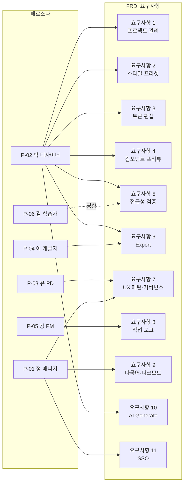
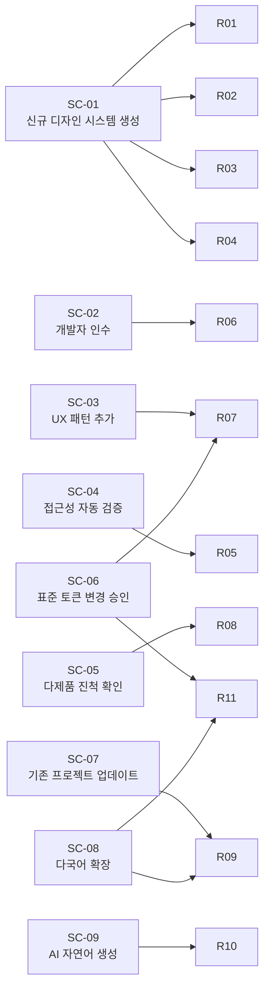

# FRD — XDS-001 디자인 시스템 생성 도구 기능 요구사항

- 프로젝트 ID: XDS-001
- 문서 ID: XDS-001-FRD
- 작성자: 유혜원 (frd skill, Creator 역할)
- 검토자: 미지정 (PD 검토 게이트 대기)
- 초기 작성일: 2026-05-12
- 마지막 갱신: 2026-05-12
- 상태: **Draft**
- 참조 PCD: PCD-001
- 참조 USD: docs/planning/XDS-001/2026-05-12-XDS-001-usd.md

> **TL;DR** 디자인 시스템 작성을 *문서 직접 작성*에서 *도구 생성*으로 전환하기 위한 사내 도구 XDS Generator의 기능 요구사항. 11개 핵심 요구사항(프로젝트 관리·스타일 프리셋·토큰 편집·컴포넌트 프리뷰·접근성 검증·Export·UX 패턴·작업 로그·다국어·AI Generate·SSO)을 v0.1 MVP부터 v1.0까지 4단계로 구현하며, WCAG 2.2 AA + KWCAG 2.2를 산출 단계에서 자동 강제한다.

## 이 문서가 묻는 결정

- [x] **MVP 범위**: USD P0 시나리오 4개(SC-01·02·03·04)를 v0.1에 모두 포함 — 결정 (SC-03은 부분 지원)
- [x] **접근성 강제 수준**: WCAG 2.2 AA + KWCAG 2.2 동시 강제 — 결정
- [x] **로그 보관**: 영구 — 결정
- [x] **i18n**: 한국어 단독 시작 + 다국어 확장 구조 사전 확보 — 결정
- [x] **로그인 시점**: v0.3 deferred — 결정
- [ ] **운영 책임 조직**: 도구의 장기 운영 담당 조직 미정 — *공개 질문*
- [ ] **저장소·배포 방식**: 사내 망 전용 vs. 자이닉스 통제 SaaS — *공개 질문* (보안 정책 검토 필요)
- [ ] **AI Generate 호출 한도**: v0.4 도입 전 LLM 비용 한도 확정 필요 — *공개 질문*

## 트레이드오프 / 대안

- **자동 보정 옵트인 vs. 자동 적용**: 접근성 미달 시 자동 보정을 *디자이너 옵트인*으로 두면 디자인 의도 보존 가능하나 의식적 결정 부담이 늘어남. 반대로 *자동 적용*하면 부담은 줄지만 디자이너가 토큰을 의도와 다르게 받게 됨. 본 FRD는 옵트인 채택.
- **단방향 export vs. Figma 양방향 sync**: 양방향 sync는 디자이너 워크플로 친화적이나 충돌 해결 비용이 큼. v1.0까지 단방향 export, v1.x 이후 양방향 검토.
- **컴포넌트 코드 자동 생성 미포함**: 토큰·명세는 생성하나 React/Vue 등 실제 컴포넌트 코드는 별도. 도구가 직접 생성 시 프레임워크 종속이 발생, 유지비용이 큼.

---

## 1. 개요

XDS Generator는 자이닉스 4개 제품 라인(B2B 어드민·LMS·AICMS·B2C)을 위한 디자인 시스템 생성 도구다. 디자이너·PD가 GUI에서 디자인 의도(스타일 프리셋·Seed Token·도메인 특화 요소)를 선택·조정하면, 도구가 표준 형식의 산출물(토큰 JSON·CSS·TS·Tailwind preset, 컴포넌트 명세 MD, UX 가이드, 접근성 보고서)을 자동 생성한다. 산출물은 read-only 원칙을 따르며, 도구가 SSoT(Single Source of Truth)다.

도구는 디자이너 1회 결정(Seed Token)으로부터 Map·Alias를 알고리즘적으로 파생하고, 다크모드·다국어 확장을 토큰 차원에서 흡수하며, WCAG 2.2 AA와 KWCAG 2.2 64개 항목을 Export 직전 자동 검증한다. 회사 표준 토큰의 변경은 거버넌스 워크플로를 거쳐 모든 프로젝트에 전파된다.

## 2. 배경

PCD-001 §3 Problem에서 정의된 세 가지 문제(세 개의 굵은 문단으로 기술됨) — 디자이너·PD가 신규 프로젝트마다 디자인 시스템을 손으로 작성하는 1~2주 비용, 산출물 형식 불일치로 인한 개발 인수 재작업, 출시 직전 접근성 인증 보완 요구 반복 — 을 도구화로 해소한다. 자이닉스가 동시에 운영하는 4개 제품 라인의 곱연산 비용과 교육·공공 도메인의 정보통신접근성 인증 의무가 이 도구의 존재 근거다.

## 3. 범위

### In Scope

- 자이닉스 4개 제품 라인 지원 (B2B 어드민·LMS·AI·B2C)
- 7개 스타일 프리셋(기본·다크·둥근·미니멀·트렌디·유리·각진) + AI Generate
- 30~40개 공통 컴포넌트 + 라인별 도메인 컴포넌트
- 5종 산출물 형식 (MD·JSON·CSS·TS·Tailwind preset) + 전체 zip 패키지
- WCAG 2.2 AA + KWCAG 2.2 자동 검증 + 자동 보정 옵트인 제안
- 작업 로그 영구 보관
- Google SSO (xinics.com 도메인) — v0.3+
- 한국어 + 다국어 확장 구조 사전 확보
- Figma Tokens Studio 호환 JSON export — v0.3+
- Storybook 호환 데이터 export — v0.3+
- AI Generate (자연어 톤 묘사 → Seed 후보 3종) — v0.4+

### Out of Scope

- 자이닉스 외부 협력사 사용자 지원 (v1.0 이후)
- 멀티테넌트 (서브 브랜드 격리)
- Figma 양방향 실시간 동기화 (단방향 export만)
- React/Vue 컴포넌트 *구현 코드* 자동 생성 (명세만 생성)
- 모바일 네이티브 앱용 토큰 출력 형식 (iOS/Android XML 등)
- 기존 4개 제품 라인 도메인 컴포넌트의 일괄 마이그레이션 (v1.0 이후 별도 가이드)

## 4. 사용자 및 시나리오

본 FRD는 USD에서 정의된 페르소나 6명과 시나리오 9개를 입력으로 한다.

| 페르소나 | 주요 시나리오 | 관련 요구사항 |
|---|---|---|
| P-02 박 디자이너 | SC-01·04·07·09 | 1, 2, 3, 4, 5, 6, 10 |
| P-04 이 개발자 | SC-02 | 6 |
| P-03 유 PD | SC-03 | 7 |
| P-05 강 PM | SC-05 | 8 |
| P-01 정 매니저 | SC-06·08 | 7, 9, 11 |
| P-06 김 학습자 | SC-04 (영향) | 5 (산출물 접근성 보장) |

시나리오 → 요구사항 흐름:

## 5. 요구사항

### 요구사항 1 — 디자이너가 프로젝트를 생성·열기·복제할 수 있다 (P0, SC-01)

박 디자이너가 신규 AI 학습 도구 프로젝트를 시작할 때, 도구의 대시보드에서 새 프로젝트를 만들고 프로젝트 타입(어드민/LMS/AI/B2C)을 선택할 수 있어야 한다. 기존 프로젝트는 목록에서 열거나 복제하여 새로운 변형 작업의 출발점으로 삼을 수 있다.

**구체 동작:**

- 대시보드 화면에서 "+ 새 프로젝트" 버튼으로 생성 모달 진입
- 프로젝트 메타 입력 — 이름, 타입(`admin`/`lms`/`ai`/`b2c`), 설명, 작업자(v0.1에서는 수동 입력, v0.3 이후 SSO 자동 채움)
- 프로젝트 목록은 그리드·리스트 두 가지 보기, 검색·필터·정렬 지원
- 프로젝트 복제 시 기존 프로젝트의 토큰·프리셋·컴포넌트 변형이 그대로 복사되고 새 ID·새 이름 부여
- 아카이브는 삭제 대체 — 목록에서 숨김 처리, 아카이브 탭에서 복원 가능 (v0.2)
- 프로젝트별 마지막 작업 시점·작업자·버전이 카드에 노출

**경계 조건:**

- 프로젝트 이름은 자이닉스 영문·한글 혼용 가능, 1~100자
- 동일 이름 프로젝트는 ID로 구분되어 허용 (사용자에게 경고만)
- 프로젝트 데이터 저장 실패 시 §4.1 자동 저장 실패 처리 절차 따름
- 첫 사용자에게는 빈 상태 화면 + 4개 타입 카드 + 예제 프로젝트 3개 제공

### 요구사항 2 — 디자이너가 스타일 프리셋을 선택하고 도구가 프로젝트 타입에 맞는 추천을 강조한다 (P0, SC-01)

스타일 프리셋은 도구가 제공하는 시각 톤의 기본 묶음이다. 박 디자이너는 7개 프리셋 중 하나를 선택해 즉시 디자인 시스템의 출발점을 잡는다. 도구는 현재 프로젝트 타입에 적합한 프리셋을 ★ 표시로 강조하되 선택을 강제하지 않는다.

**구체 동작:**

- 에디터 좌측 패널에 7개 프리셋(기본·다크·둥근·미니멀·트렌디·유리·각진) + AI Generate가 단일 flat 리스트로 표시
- 프리셋 한글 라벨로 명명, 역할명(학습자·교수자·운영자) 사용 금지
- 프로젝트 타입에 따라 Style Preset Catalog §5의 1순위 프리셋이 ★ 강조 + 리스트 상단 자동 정렬
- 프리셋 클릭 시 16ms 내 중앙 프리뷰·우상 토큰 패널 동기 갱신
- 각 항목 hover 300ms 후 5초 미니 미리보기 팝오버
- 모든 프리셋은 Default를 1단계 extend, 자식 프리셋의 토큰 override는 잠금 가능(`@locked-override`)
- 유리·블러 프리셋은 단독 사용 금지, 다른 프리셋 위에 액센트로만 적용

**경계 조건:**

- 사용자가 추천 외 프리셋을 선택해도 차단·경고 없음 (자유 선택)
- 프리셋 변경 시 디자이너가 이전 프리셋에서 수동 조정한 토큰은 잠금 표시되어 보존 (확인 모달)
- AI Generate 프리셋은 v0.4부터 활성화, 그 전에는 비활성화 + "준비 중" 라벨

### 요구사항 3 — 디자이너가 디자인 토큰을 GUI에서 조정한다 (P0, SC-01)

박 디자이너는 우상 패널의 Customize Theme 영역에서 Seed Token을 직접 조정한다. Seed 변경은 Map·Alias의 자동 파생을 트리거하고, 디자이너는 결과를 우상 패널과 중앙 프리뷰에서 즉시 확인한다.

**구체 동작:**

- Quick Access 영역: Primary Color(OKLCH/HEX 컬러피커 + 7색 스와치), Border Radius(0~24px 슬라이더 + 숫자), Density(라디오), Font Family(셀렉트)
- 고급 설정 영역(접힘): Seed 9종 전체 + 다크모드 수동 override 영역
- Seed 변경 시 Map(11단 컬러 스케일 + 4단 상태 변형 + 8단 사이즈 + 7단 모서리 + 7단 타이포)이 OKLCH 기반 알고리즘으로 자동 파생
- Alias 매핑은 기본 자동, 디자이너가 일부 수동 변경 가능
- Undo/Redo (Cmd/Ctrl+Z, Shift+Cmd/Ctrl+Z, 최소 50단계)
- 자동 저장 5초 디바운스, 실패 시 비차단 토스트·로컬 임시 보관·재시도 3회
- 컴포넌트는 Alias 토큰만 참조 (리터럴 직접 사용 금지, 위반 시 export 차단)

**경계 조건:**

- 토큰 슬라이더 조정 → 프리뷰 갱신 P95 16ms 이하
- 디자이너가 Map 토큰을 수동 override한 후 Seed를 다시 변경하면 확인 모달 ("자동 파생이 수동 값을 덮어쓰려고 합니다. 진행하시겠어요?")
- 토큰 참조 사이클(A→B→A)은 Export 차단
- 미사용 토큰은 경고만, 제거 권고

### 요구사항 4 — 컴포넌트가 라이브 프리뷰로 실시간 표시된다 (P0, SC-01)

박 디자이너는 중앙 패널에서 컴포넌트들이 현재 토큰·프리셋 상태에서 어떻게 보이는지 즉시 확인한다. 표시 범위는 3단계 토글(L1·L2·L3)로 디자이너가 직접 결정한다.

**구체 동작:**

- L1 핵심 5종(Button·Input·Card·Modal·Form)은 항상 표시 — 스타일 톤 즉시 판단
- L2 확장 14종(Dropdown·DatePicker·ColorPicker·Tags·Progress·Steps·Slider·Switch·Checkbox·Radio·SegmentedControl·Tooltip·Toast·Tabs)은 토글로 전환
- L3 전체 30+종은 Storybook 매트릭스 스타일로 표시 (각 컴포넌트의 variant·size·state 조합 동시 노출)
- L4 도메인 컴포넌트는 프로젝트 타입에 따라 자동 큐레이션 (LMS: ProgressBar·LessonItem 등 / Admin: DataTable·FilterPanel 등 / AI: ChatBubble·PromptInput 등 / B2C: HeroSection·PricingCard 등)
- 모바일·태블릿·데스크탑 뷰포트 토글 — v0.3+
- 색맹(적-녹) 시뮬레이션 + `prefers-reduced-motion` 토글 — v0.3+
- 컴포넌트 클릭 시 우상 토큰 패널이 해당 컴포넌트의 토큰 매핑으로 자동 포커스

**경계 조건:**

- 전체 30+종 동시 렌더링 시 초기 로드 P95 1.5초 이하
- 프리뷰 갱신은 토큰 변경 후 16ms 이내
- 사용자가 보지 않은 L3·L4 컴포넌트는 Export 직전 일괄 검토 단계로 강제 노출 (요구사항 6 참조)

### 요구사항 5 — 접근성이 자동 검증되며 미달 시 Export가 차단된다 (P0, SC-04, P-06 영향)

박 디자이너가 토큰을 조정한 직후 도구가 접근성 점검을 수행한다. WCAG 2.2 AA와 KWCAG 2.2 두 기준 모두에 대해 64개 항목을 검증하고, 미달 시 Export 단계로 진입할 수 없게 한다. 김 학습자가 고대비·스크린리더·키보드로 LMS 강의를 진행할 수 있는 상태가 자동 보장된다.

**구체 동작:**

- 검증 항목 64개: 인지가능성 18 + 운용가능성 16 + 이해가능성 14 + 견고성 8 + KWCAG 한국 특화 8
- 검증 시점: 토큰 변경 직후 실시간, 프로젝트 로드 시 캐시 결과, Export 직전 최종 점검
- 자동 검증 엔진: axe-core + lighthouse CI + 자체 한국어 룰 (K-01~K-08 + P-08~P-10 담당)
- 우하 패널에 항목별 통과/미달 카운트 + 미달 항목 클릭 시 원인 토큰·컴포넌트 표시
- 자동 보정 제안 — 색상 대비비·포커스 링·터치 타겟·자간·행간에 대해 옵트인 보정값 제안. 도구가 자동 적용하지 않음. 디자이너가 [적용]·[무시] 선택
- Export 차단 처리: 미달 항목이 1개라도 있으면 Export 버튼 비활성화 + 미달 목록 표시
- 항목별 처리 정책은 Accessibility Spec §10.2 매트릭스 참조 (자동 검증 약 50개 / 수동 검토 14개)

**경계 조건:**

- WCAG 또는 KWCAG 미달 시 차단 (Spec §4.3)
- 경고만 항목(자간·행간 등)은 미달이어도 Export 가능, 경고 카운트 표시
- 디자이너가 보정 제안 [무시] 선택 시 미달 상태 유지 → Export 차단 유지
- 검증 엔진 자체 오류 시 사용자에게 비차단 알림 + 마지막 검증 결과 표시

### 요구사항 6 — 디자이너가 표준 산출물을 zip 패키지로 Export하고 개발자가 추가 해석 없이 인수한다 (P0, SC-01·SC-02)

박 디자이너가 검증 통과 후 Export 버튼을 누르면 도구가 표준 형식의 산출물 zip 패키지를 생성한다. 이 개발자는 패키지를 받아 자신의 프로젝트 리포에 그대로 가져와 토큰·컴포넌트 명세를 코드에 반영한다.

**구체 동작:**

- Export 3단계 마법사: ① 미검토 컴포넌트 일괄 확인 → ② 출력 옵션 선택 → ③ 확인·다운로드
- 1단계 — 디자이너가 화면에서 보지 않은 L3·L4 컴포넌트를 순환 표시, 각각 [확인]·[추가 조정] 두 버튼. 모두 [확인] 후 다음 단계로
- 2단계 — 자동 포함 항목(manifest.json·README·CHANGELOG·tokens.seed/map/alias) + 선택 가능 항목(tokens.json·CSS·TS·Tailwind preset·Figma·Storybook·컴포넌트 MD·UX 가이드·접근성 보고서·zip)
- 3단계 — 패키지 미리보기 + 이전 버전 대비 diff 요약 (v0.2+) + [다운로드] 버튼
- 파일명 규칙: `{파일종류}_v{semver}_{YYYYMMDD}.{확장자}` (Output Spec §1.2)
- 같은 날 중복 export 시 `_HHmm` 시간 suffix 자동 추가
- 모든 export 파일에 `GENERATED BY XDS Generator v{version} — DO NOT EDIT MANUALLY` 헤더 주석
- 패키지 manifest.json에 sha256 체크섬 포함, 모든 files[] 항목 무결성 검증 가능
- Export 액션은 작업 로그(요구사항 8)에 자동 기록

**경계 조건:**

- 접근성 미달 시 Export 버튼 비활성화 (요구사항 5)
- 패키지 zip 생성 P95 3초 이하
- 변경된 산출물만 부분 export 가능 (v0.2+) — 이전 export 대비 diff
- 도구 버전(`generatorVersion`)이 manifest에 포함되어, 향후 도구 업데이트 후 stale 알림 가능

### 요구사항 7 — PD가 UX 패턴을 추가하고 디자인 시스템 오너가 표준 변경을 승인·전파한다 (P0·P1, SC-03 부분·SC-06)

유 PD는 프로젝트 진행 중 발견한 UX 패턴(예: 진도 80% 시 격려 메시지)을 디자인 시스템의 UX 가이드 영역에 추가하고, 회사 차원 표준으로 격상할 가치가 있다고 판단되면 디자인 시스템 오너에게 검토를 요청한다. 정 매니저는 회사 표준 토큰 변경 제안을 받으면 4개 제품 라인 각각에 대한 영향을 미리보기로 확인하고 승인한다.

**구체 동작:**

- UX 가이드 영역(v0.2+) — 에디터 내 별도 탭. 패턴 카드 추가 시 사용 케이스·회피 케이스·예시 화면을 정리
- PD가 패턴 카드를 "회사 표준 격상 검토" 플래그로 표시 → 디자인 시스템 오너에게 알림
- 회사 표준 토큰(Global Tokens)은 거버넌스 탭(v0.3+)에서 관리, 변경 시 영향도 미리보기 — 4개 제품 라인 각각에서 어떤 컴포넌트가 어떻게 변하는지 시각화
- 표준 토큰 변경 승인 후 각 프로젝트는 알림 받음, 디자이너가 받을 변경·잠금할 변경 선택 가능
- v1.0에서는 명시적 승인 워크플로 (PD 리뷰 게이트 빌트인)

**경계 조건:**

- v0.1에서는 UX 가이드 영역 미제공 — 컴포넌트 명세 MD에 패턴 메모 추가만 가능 (SC-03 부분 지원)
- v0.2에서 본격 UX 가이드 영역 활성화
- 표준 토큰 변경은 사용자 식별(SSO)에 의존하므로 v0.3부터 본격 운영

### 요구사항 8 — PM이 모든 프로젝트의 작업 로그와 진척을 확인한다 (P1, SC-05)

강 PM은 도구의 작업 로그·진척 대시보드에서 4개 제품 라인의 디자인 시스템 작업 상태를 한 화면에서 확인하고 주간 일정에 반영한다.

**구체 동작:**

- 작업 로그 자동 기록 — 프로젝트 생성·열기·토큰 변경·프리셋 변경·Export·복제·아카이브 모든 액션
- 로그 엔티티 필드 — `id`(자동증가 정수, 1부터), `projectName`, `creator`(v0.1 수동 입력, v0.3+ SSO 자동), `createdAt`(ISO 8601 UTC 저장, KST 표시), `action`(create·update·export·duplicate·archive), `styleName`, `outputs[]`
- `outputs[]` 항목 필드 — `type`(tokens·component·guide·bundle), `filename`, `size`, `checksum`, `version`, `generatorVersion`
- 메인 화면 우측 하단 "최근 작업" 타임라인 (최근 5건, 클릭 시 에디터 진입)
- 별도 "활동 로그" 탭 — 필터(프로젝트·작업자·기간·액션 타입) + 검색 + CSV/JSON export (v0.2+)
- 로그 영구 보관 — 자동 삭제 없음, 어드민 수동 삭제는 v0.3+ 별도 권한
- 로그 자체 변조 방지 — append-only

**경계 조건:**

- v0.1에서는 메인 화면 타임라인 + 최소 필드만, 별도 탭 없음
- v0.2부터 전체 탭·필터·검색·export 활성화
- v0.3 SSO 도입 시 기존 수동 입력 `creator`는 "unverified" 플래그 유지, 가능하면 1회 일괄 매칭 절차 제공

### 요구사항 9 — 다국어 확장 구조와 다크모드가 토큰 차원에서 흡수된다 (P1·P2, SC-07·SC-08)

박 디자이너가 회사 표준 토큰이 갱신되었다는 알림을 받으면 자신의 프로젝트를 열어 변경 사항을 비교·선택 적용한다. 정 매니저가 LMS 영어 시장 진입을 결정해 언어를 추가하면 디자인 체계 재작성 없이 토큰 차원에서 확장된다.

**구체 동작:**

- **다크모드** — OKLCH 명도 반전·채도 약간 감소·색조 유지 알고리즘으로 Seed에서 자동 파생. 디자이너가 수동 override 가능. Override는 `_dark_locked: true`로 알고리즘 재계산 시 보존 가능
- 우선순위 규칙 — 수동 override 우선, 알고리즘은 빈 슬롯만 채움, Seed 재변경 시 잠금되지 않은 override는 자동 갱신·확인 dialog
- **다국어 확장 구조** — 토큰 정의에 `_locale_*` 조건 분기 키를 v0.2부터 사전 정의 (값은 빈 상태로 자리만 확보)
- 한국어 단독 시작 — v0.1·v0.2에서는 `default` locale만 채워짐
- 다국어 진입 시 — 추가 언어용 폰트 스택, 자간·행간, 컴포넌트 변형(영문 평균 70% 길이) 검토·승인 단계 제공
- 한국어 가독성 토큰 — `letterSpacing.korean: -0.01em`, `lineHeight.korean: 1.6` (KWCAG 반영)

**경계 조건:**

- v0.1에서 다국어 토큰 구조 미적용 — `default`만 사용
- v0.2에서 `_locale_*` 키 구조 사전 정의 (실제 다국어 진입은 별도 시점)
- 다크모드 자동 파생이 KWCAG 대비비를 만족하지 못하면 미달 항목으로 표시되어 디자이너가 수동 조정 필요

### 요구사항 10 — 디자이너가 자연어 톤 묘사로 AI Generate 후보를 받는다 (P2, SC-09)

박 디자이너가 새 AI 학습 도구의 톤을 자연어로 묘사하면 도구가 LLM에 요청해 Seed Token 후보 3종을 제안한다. 디자이너는 후보 중 하나를 선택해 수동 조정으로 다듬는다.

**구체 동작:**

- AI Generate 모달 — 자연어 입력(한국어/영어, 50자 이상 권장) + [✨ 후보 3종 생성] 버튼
- LLM 호출 시 구조화된 시스템 프롬프트 + JSON 응답 강제, OKLCH 좌표·radius·fontFamily 후보 반환
- 결과 표시 — 후보 3종을 미니어처 카드로 나란히, 각 카드에 Primary 색·Radius·미리보기 + [선택] 버튼
- 선택한 후보는 신규 프리셋으로 저장, 라벨에 "AI 생성, 수동 검토 필요" 표시
- 호출 한도 — 사용자별 월 N회 (v0.4 출시 시점에 확정 필요, 잠정 50회)
- 결과는 검증 규칙(대비비·KWCAG) 자동 통과 후에만 적용 가능
- 작업 로그·manifest.json에 LLM 사용 사실 기록 (`style.aiGenerated: true`)

**경계 조건:**

- v0.4부터 활성화, 이전 버전은 비활성화 + "준비 중"
- 자연어가 모호하거나 한도 도달 시 명확한 오류 메시지
- 외부 LLM 호출 실패 시 비차단 알림 + 사용자에게 재시도·다른 후보 선택 옵션

### 요구사항 11 — Google SSO로 xinics.com 도메인 사용자만 로그인한다 (P1, v0.3+)

도구 사용자가 xinics.com 워크스페이스 계정으로 로그인하면 작업자가 자동 식별되어 작업 로그·표준 토큰 변경 승인 워크플로의 신뢰성이 확보된다.

**구체 동작:**

- Google OAuth 2.0 인증 요청에 `hd=xinics.com` 파라미터 첨부 — 로그인 UI에서 비-자이닉스 계정 진입 차단
- 백엔드에서 ID 토큰의 `hd` 클레임 재검증 — 클라이언트 우회 방지
- 인증 성공 후 세션 토큰 발급, 자동 로그아웃은 24시간 비활성 후
- 익명 작업 모드 — v0.1·v0.2에서는 로그인 없이 사용, 작업자 필드는 수동 텍스트 입력
- v0.3 SSO 도입 시 기존 데이터 마이그레이션 — `creator` 필드는 동일 스키마 유지, 과거 로그의 `creator`는 unverified 플래그 표시, SSO 도입 후 1회 일괄 매칭 절차 제공

**경계 조건:**

- 워크스페이스 어드민 정책에 따라 도구를 자이닉스 내부 앱으로 등록 필요 (PRD §7.1)
- 외부 협력사 사용자는 v1.0 이후 별도 검토 — 본 요구사항 범위 외
- SSO 장애 시 비차단 알림 + 인증 미완 사용자에게 "로그아웃 후 재시도" 안내

## 6. 비기능 요구사항

### 성능
- 토큰 조정 → 프리뷰 갱신: P95 16ms 이하 (60fps)
- 컴포넌트 30+종 동시 렌더링 초기 로드: P95 1.5초 이하
- Export 패키지 생성: P95 3초 이하
- 자동 저장: 5초 디바운스, 실패 시 3회 자동 재시도 + 로컬 임시 보관

### 접근성
- 도구 자체와 도구가 생성하는 산출물 모두 WCAG 2.2 AA + KWCAG 2.2 강제
- Accessibility Spec §3의 64개 항목 전체 검증
- 도구 UI는 v0.1부터 적용, 산출물 검증은 Export 단계에서 강제

### 브라우저·환경
- Chrome / Edge / Firefox / Safari 최신 2버전
- 데스크탑 우선(1280px+), 태블릿 보조(768~1023px), 모바일 미지원
- IE·구형 브라우저 미지원

### 보안
- 모든 통신 HTTPS
- v0.3+ Google SSO + 사내 통제 저장소
- 작업 로그 append-only, 변조 방지
- 외부 LLM 호출(v0.4) 시 사내 정책 검토 후 활성화

### 확장성
- 컴포넌트 추가가 도구 코드 수정 없이 데이터로 가능
- 새 프리셋 추가가 JSON 파일 추가만으로 가능
- 새 언어 추가가 토큰 구조 변경 없이 가능
- 새 산출물 형식 추가가 export 모듈 단위 격리

## 7. 통과 기준 (거시 지표)

| 지표 | 측정 방법 | 목표 |
|---|---|---|
| 신규 프로젝트 디자인 시스템 작성 시간 | 프로젝트 생성→첫 Export까지 평균 시간 | 1~2주 → 1~2시간 (90% 단축) |
| 접근성 인증 보완 요구 발생 건수 | 도구 export 후 출시된 프로젝트의 KWCAG 심사 보완 요구 건수 | 0건 |
| 디자이너·개발자 인수 재작업 시간 | 인수 후 토큰·컴포넌트 명세 재해석·변환 시간 | 평균 3일 → 0.5일 이하 |
| 도구 자체 접근성 점검 통과율 | axe-core + 자체 한국어 룰 자동 점검 통과율 | 100% 유지 |
| 도구 채택률 | v1.0 시점 디자이너·PD 활성 사용자(MAU) 비율 | 90%+ |
| 산출물 stale 감지율 | Export된 산출물의 `generatorVersion`과 도구 현재 버전 비교 알림 정확도 | 100% |

본 FRD는 거시 지표만 정의한다. 항목별 검증 시나리오는 verify 단계에서 자동 생성된다.

## 8. 변경 이력

| 버전 | 날짜 | 변경 내용 | 변경자 |
|---|---|---|---|
| v1 | 2026-05-12 | 초기 Draft 작성 — 11개 핵심 요구사항 정의, PCD-001 + USD 입력, Draft 상태 | 유혜원 (frd skill) |

## 부록 A. 추적 매트릭스

| 요구사항 | 관련 PCD | 관련 USD 시나리오 | 관련 우선순위 | 출시 단계 |
|---|---|---|---|---|
| 1. 프로젝트 관리 | PCD-001 | SC-01 | P0 | v0.1~v0.2 |
| 2. 스타일 프리셋 | PCD-001 | SC-01 | P0 | v0.1(Default만)~v0.2(7개) |
| 3. 토큰 편집 | PCD-001 | SC-01 | P0 | v0.1 |
| 4. 컴포넌트 프리뷰 | PCD-001 | SC-01 | P0 | v0.1(L1)~v0.3(L4·시뮬레이션) |
| 5. 접근성 검증 | PCD-001 | SC-04 (P-06 영향) | P0 | v0.1 (자동 보정 v0.2+) |
| 6. Export | PCD-001 | SC-01·SC-02 | P0 | v0.1(MD·JSON·CSS·zip)~v0.3(Figma·Storybook) |
| 7. UX 패턴·거버넌스 | PCD-001 | SC-03·SC-06 | P0·P1 | v0.1 부분(메모만)~v0.3+(전체) |
| 8. 작업 로그 | PCD-001 | SC-05 | P1 | v0.1(타임라인)~v0.2(필터·export) |
| 9. 다국어·다크모드 | PCD-001 | SC-07·SC-08 | P1·P2 | v0.2(구조)~v0.3+(다국어 진입) |
| 10. AI Generate | PCD-001 | SC-09 | P2 | v0.4 |
| 11. Google SSO | PCD-001 | SC-06·SC-08 (간접 — 작업자 식별) | P1 | v0.3 |

## 부록 B. 참조 보조 문서

본 FRD를 구체화하는 보조 명세서:
- Token Schema (`2026-05-12-XDS-001-token-schema.md`) — 디자인 토큰 데이터 모델
- Output Spec (`2026-05-12-XDS-001-output-spec.md`) — 산출물 형식 정의
- Style Preset Catalog (`2026-05-12-XDS-001-style-preset-catalog.md`) — 7개 프리셋 + AI Generate
- UI Spec (`2026-05-12-XDS-001-ui-spec.md`) — 도구 화면 명세
- Accessibility Spec (`2026-05-12-XDS-001-accessibility-spec.md`) — WCAG·KWCAG 64개 항목
- PRD (`2026-05-12-XDS-001-prd.md`) — 제품 요구사항 정의서(개요)