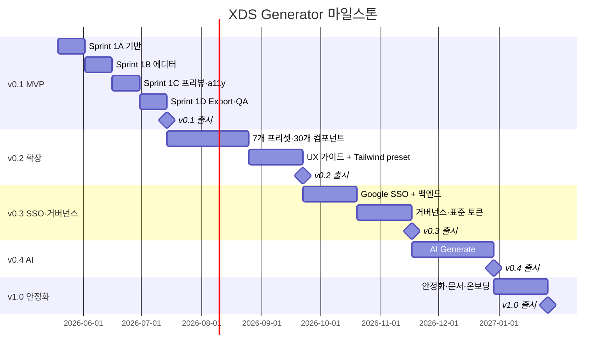

# Build Kickoff — XDS-001 도구 개발 단계 진입 가이드

- 작성일: 2026-05-12
- 작성자: 유혜원
- 상태: Active
- 이슈키: XDS-001
- 목적: 12개 명세서를 개발팀에 인수하고 도구 빌드를 즉시 시작할 수 있는 형태로 정리

> **TL;DR** 12개 명세서 묶음을 개발팀에 인수하기 위한 단일 진입 문서. 명세서 읽는 순서·해소해야 할 의사결정 4건·기술 스택 제안·Sprint 1 (v0.1 MVP) 백로그 8주치 티켓 분해·팀 구성·마일스톤 9개월 정의. 본 문서를 읽고 의사결정 4건을 통과시키면 Sprint 1을 시작할 수 있다.

## 이 문서가 묻는 결정

- [ ] **운영 책임 조직 확정** — 디자인팀 / 플랫폼팀 / 별도 신설
- [ ] **저장소·배포 방식** — 사내 망 전용 / 자이닉스 통제 SaaS / 하이브리드 (보안 정책 검토 필요)
- [ ] **기술 스택 확정** — 본 문서 §4의 제안 채택 여부
- [ ] **AI Generate LLM 호출 한도·예산** — 월 N회/사용자, 월 비용 한도 (v0.4 직전까지 결정 가능)

위 4건이 해소되어야 Sprint 1 착수 가능.

---

## 1. 산출물 인수 — 12개 명세서 읽는 순서

개발팀이 다음 순서로 읽으면 효율적이다.

### Tier 1 — 맥락 파악 (1일)
| # | 문서 | 분량 | 읽는 이유 |
|---|---|---|---|
| 1 | PCD-001 | 짧음 | *왜* 이 도구가 필요한가 (문제·해결 방향) |
| 2 | USD | 중간 | *누가* 쓰는가 (페르소나 6명·시나리오 9개) |
| 3 | PRD | 큼 | *무엇을* 만드는가 (기능 트리·릴리즈 단계·KPI) |
| 4 | FRD | 큼 | *언제까지·어떤 기준으로* 통과시키는가 (11개 요구사항) |

### Tier 2 — 기술 설계 입력 (1~2일)
| # | 문서 | 분량 | 읽는 이유 |
|---|---|---|---|
| 5 | Token Schema | 큼 | 데이터 모델의 뼈대. 모든 기능이 이 위에 얹힘 |
| 6 | Output Spec | 큼 | 도구가 *내뱉는 것*의 정확한 형식. read-only 원칙 |
| 7 | Style Preset Catalog | 큼 | 7개 프리셋 + AI Generate의 입출력 |
| 8 | UI Spec | 큼 | 화면 명세 — 7개 화면 + 4-panel 에디터 |
| 9 | Accessibility Spec | 큼 | WCAG·KWCAG 64개 항목 강제 규칙 |

### Tier 3 — 참고 자료 (필요 시)
| # | 문서 | 분량 | 읽는 이유 |
|---|---|---|---|
| 10 | 01_research | 중간 | 시중 디자인 시스템 분석 (Ant·MUI·shadcn 등) |
| 11 | 02_architecture | 중간 | 초기 아키텍처 구상 (지금은 PRD·Token Schema가 정본) |
| 12 | 03_style_presets | 중간 | 초기 프리셋 정의 (지금은 Style Preset Catalog가 정본) |

**총 예상 인수 시간**: 사전 디자인 시스템 경험 있는 개발자 기준 2~3일.

---

## 2. 미해결 의사결정 (블로커)

Sprint 1 착수 전 반드시 해소.

### 2.1 운영 책임 조직
- 도구의 장기 운영·유지보수·KPI 책임 조직 미정
- 후보: 디자인팀 / 플랫폼팀 / 별도 신설팀
- **권장**: 디자인팀(오너십) + 플랫폼팀(기술 운영) 협력 모델. 디자인 시스템 오너 P-01 정 매니저가 거버넌스 책임
- 결정 주체: CTO·CDO 수준 합의

### 2.2 저장소·배포 방식
- 도구의 데이터(프로젝트·작업 로그·산출물 메타) 저장 위치
- 옵션 A — **사내 망 전용**: 보안 강함, 외부 접근 불가, 운영 비용 큼
- 옵션 B — **자이닉스 통제 SaaS** (Firebase/Supabase): 운영 단순, 비용 낮음, 데이터 외부 의존
- 옵션 C — **하이브리드**: 코드·메타는 외부 SaaS, 산출물 zip은 사내 망 저장
- 결정 주체: 보안 검토팀 + 인프라팀

### 2.3 기술 스택 확정
- 본 문서 §4의 제안 채택 여부
- 채택 시 즉시 Sprint 1 착수 가능

### 2.4 AI Generate 비용 한도 (v0.4 직전까지 결정 가능)
- LLM API 호출 비용 한도 (사용자별·전사·월 단위)
- v0.4 출시 약 6개월 후이므로 Sprint 1 블로커는 아니나, 일정 내 결정 필요

---

## 3. 자이닉스 보유 자산 활용 가능 여부

도구 빌드에 활용 가능한 사내 자산:

| 자산 | 활용 방안 |
|---|---|
| Figma MCP (보유 중) | Figma Tokens Studio 호환 JSON export(v0.3+) 검증·테스트 |
| Atlassian Jira/Confluence MCP (보유 중) | Sprint 백로그 관리, FRD/PCD/USD Confluence 동기화 (선택) |
| Google Workspace (xinics.com) | SSO 연동 (v0.3+) |
| 기존 LMS·AICMS 코드베이스 | 도메인 컴포넌트 L4 정의의 입력 자료 |

---

## 4. 기술 스택 제안

### 4.1 프론트엔드
| 영역 | 제안 | 대안 | 근거 |
|---|---|---|---|
| 프레임워크 | **React 18 + TypeScript** | Vue 3, Svelte | 도구가 생성하는 디자인 시스템의 주 타겟이 React 생태계와 호환됨. 팀 친숙도 가정 |
| 빌드 | **Vite** | Next.js | SPA 도구 — SSR 불필요, 빠른 dev 사이클 |
| 라우팅 | **React Router v6** | TanStack Router | 표준, 학습 곡선 낮음 |
| 상태 관리 | **Zustand + Immer** | Redux Toolkit, Jotai | 토큰 트리·undo/redo에 적합 |
| 스타일링 | **Tailwind CSS + CSS Variables** | styled-components | 도구가 토큰 시연 무대이므로 CSS Variables 필수 |
| 컬러피커 | **react-colorful** + 자체 OKLCH 확장 | react-color | OKLCH 색공간 직접 다룸 |
| 컴포넌트 라이브러리 | **Radix UI Primitives** + 자체 스타일 | shadcn/ui 직접 채택 | 도구 자체가 디자인 시스템이라 헤드리스만 사용 |
| 아이콘 | **Lucide React** | Heroicons | 표준, 자이닉스 디자인 시스템 기본 |
| 폼 | **React Hook Form + Zod** | Formik | 토큰 입력 검증에 적합 |

### 4.2 백엔드 (v0.1·v0.2는 클라이언트 단독, v0.3부터 필요)
| 영역 | 제안 | 근거 |
|---|---|---|
| 런타임 | **Node.js + Hono** (또는 Cloud Functions) | 가벼움, 빠름 |
| 인증 | **Google OAuth 2.0 + `hd=xinics.com`** | PRD A1 |
| DB | **Firestore** 또는 **Supabase Postgres** | 의사결정 2.2 결과에 따라 |
| 파일 저장 | **Cloud Storage** (zip 패키지) | 의사결정 2.2 결과에 따라 |

### 4.3 검증·CI
| 영역 | 제안 |
|---|---|
| 접근성 자동 검증 | axe-core, lighthouse-ci |
| 단위 테스트 | Vitest |
| E2E 테스트 | Playwright |
| 시각 회귀 | Chromatic (Storybook 연동) |
| 코드 품질 | ESLint, Prettier, TypeScript strict |
| 자체 한국어 룰 | 자체 구현 (Accessibility Spec §4.1) |

### 4.4 외부 의존성
| 영역 | 제안 |
|---|---|
| OKLCH 색 변환 | culori |
| Mermaid 렌더링 | mermaid (UI Spec 다이어그램 표시용, 산출물에는 텍스트로) |
| Markdown 처리 | unified + remark + rehype |
| zip 패키징 | jszip |
| W3C Design Tokens 파서 | 자체 구현 (외부 라이브러리 미성숙) |
| LLM 호출 (v0.4) | Anthropic SDK (Claude) 또는 사내 정책 결정 후 확정 |

### 4.5 채택 시 즉시 시작 가능

위 스택은 **사내 정책 충돌 가능 항목**(SaaS DB·LLM API)을 제외하면 표준 OSS 조합이다. 채택 시 v0.1 MVP 8주 일정 내 완성 가능 추정.

---

## 5. Sprint 1 백로그 — v0.1 MVP (8주)

v0.1 MVP 범위는 PRD §5와 FRD §5 요구사항 1·2(Default만)·3·4(L1만)·5·6(MD·JSON·CSS·zip만)·7(부분)·8(타임라인만)을 포함한다. SSO·9개 프리셋·30개 컴포넌트·UX 가이드는 v0.2+로 이연.

### Sprint 1A (1~2주) — 기반 셋업
**티켓 후보**:
- T-001: 프로젝트 초기화 (Vite + React + TS + Tailwind + Lucide)
- T-002: 디자인 토큰 데이터 모델 구현 (Token Schema §2 ~ §4)
- T-003: 토큰 W3C Design Tokens 포맷 파서·시리얼라이저
- T-004: OKLCH 색공간 유틸 (Map 토큰 자동 파생 알고리즘)
- T-005: CSS Variables 자동 생성 모듈
- T-006: 도구 자체 디자인 시스템 토큰 정의 (shadcn-like 차용, UI Spec §9)

### Sprint 1B (3~4주) — 에디터 본체
**티켓 후보**:
- T-007: 대시보드 화면 (프로젝트 리스트·검색·필터)
- T-008: 프로젝트 생성·열기·복제 (R1)
- T-009: 에디터 4-panel 레이아웃 (UI Spec §4)
- T-010: 좌측 패널 — 스타일 프리셋 리스트 (Default만)
- T-011: 우상 패널 — Customize Theme (Primary Color·Border Radius·Density·Font + 고급)
- T-012: 컬러피커 OKLCH·HEX·RGB·스와치 (R3)
- T-013: Undo/Redo + 자동 저장 (5초 디바운스, 실패 처리 §4.1)

### Sprint 1C (5~6주) — 프리뷰·접근성
**티켓 후보**:
- T-014: 컴포넌트 프리뷰 L1 핵심 5종 (Button·Input·Card·Modal·Form)
- T-015: 프리뷰 16ms 갱신 성능 검증
- T-016: 접근성 검증 엔진 통합 — axe-core + lighthouse
- T-017: 자체 한국어 룰 구현 (K-01·K-02·K-04·K-07 우선)
- T-018: 우하 패널 — 접근성 점검 결과 표시
- T-019: WCAG·KWCAG 64개 항목 데이터 파일 정의

### Sprint 1D (7~8주) — Export·로그·QA
**티켓 후보**:
- T-020: Export 3단계 마법사 (R6)
- T-021: 미검토 컴포넌트 일괄 확인 단계 (G8)
- T-022: 산출물 생성 — tokens.json·CSS·TS, 컴포넌트 명세 MD (L1 5종)
- T-023: manifest.json + README.md + 접근성 보고서 자동 생성
- T-024: zip 패키징 + 파일명 규칙 + 시간 suffix
- T-025: 작업 로그 자동 기록 (R8) + 메인 화면 타임라인
- T-026: 도구 자체 접근성 점검 (PRD §4.2)
- T-027: E2E 테스트 — SC-01·SC-02·SC-04 시나리오
- T-028: v0.1 RC 빌드 + 사내 알파 테스트

**총 28개 티켓 추정**. 실제 산정은 개발팀이 견적 후 조정.

---

## 6. 팀 구성 권장

### Sprint 1 (8주) 최소 구성
| 역할 | 인원 | 책임 |
|---|---|---|
| **풀스택 개발** | 1.5명 | 프론트엔드 본체 + 일부 백엔드 |
| **디자인 시스템 디자이너** | 0.5명 (자문) | 도구 자체 디자인, 토큰 결정, 사용성 검토 |
| **PD** | 0.3명 (자문) | 요구사항 검토, 변경 결정 |
| **QA** | 0.5명 (Sprint 1C부터) | E2E 테스트, 접근성 수동 검증 |

### v0.2 이후 확장
- 풀스택 +1명 (9개 프리셋·30개 컴포넌트 작업 분담)
- 백엔드 0.5명 (v0.3 SSO·저장소 본격 작업)

---

## 7. 마일스톤 (9개월)

- v0.1 출시 목표: **2026-07-14** (Sprint 1 완료)
- v0.2 출시: 2026-09-22
- v0.3 출시: 2026-11-17 (SSO 도입)
- v0.4 출시: 2026-12-29 (AI Generate)
- v1.0 정식 출시: **2027-01-26**

실제 산정은 팀 견적 후 조정.

---

## 8. KPI 모니터링 계획

FRD §7의 6개 거시 지표를 어떻게 측정할지:

| 지표 | 측정 방법 | 측정 주기 |
|---|---|---|
| 디자인 시스템 작성 시간 | 작업 로그의 프로젝트 생성→첫 Export까지 시간 | 매월 |
| 접근성 인증 보완 요구 | 출시된 자이닉스 제품의 KWCAG 심사 결과 추적 | 분기 |
| 디자이너·개발자 인수 재작업 시간 | 사용자 설문 + 시각 회귀 결함 카운트 | 분기 |
| 도구 자체 접근성 통과율 | axe-core CI 결과 | 매 PR |
| 도구 채택률 (MAU) | 도구 활성 사용자 / 자이닉스 디자이너·PD 총원 | 매월 |
| 산출물 stale 감지율 | export 시 `generatorVersion` 불일치 알림 | 자동 |

---

## 9. 리스크와 완화 (PRD §7.3 기반)

| 리스크 | 영향 | 완화 |
|---|---|---|
| 도구 학습 곡선이 디자이너 진입을 막음 | 도구 도입 실패 | v0.1부터 4단계 온보딩 투어 + 예제 프로젝트 3개. 사용성 테스트 분기별 |
| 자동 보정 제안이 디자이너 의도 침해 | 사용자 이탈 | 옵트인 + override 가능 (정책 명시) |
| KWCAG 점검 항목 정부 정책 변경 | 검증 로직 재작성 | 항목을 데이터 파일로 분리 (Accessibility Spec §8.1) |
| Export 산출물이 도구 업데이트 후 stale | 디자인-구현 불일치 | `generatorVersion` 메타 + stale 알림 |
| AI Generate 부정확·편향 시드 생성 | 품질 저하 | 라벨 강제 + 검증 통과 후만 적용 + 사용량 로그 |
| 사내 보안 정책으로 SaaS DB 사용 불가 | v0.3+ 일정 지연 | 의사결정 2.2 조기 해소 + 사내 DB 옵션 사전 검토 |

---

## 10. 다음 액션 (1주 내)

1. **본 문서 + FRD를 개발팀 리드에게 공유** — 인수 일정 협의
2. **의사결정 4건 해소** — 의사결정 2.1·2.2 → 1주 내, 2.3 기술 스택 → 2일 내, 2.4 LLM 비용 → v0.4 직전까지
3. **Jira/Linear 프로젝트 생성** — 이슈키 XDS-001 epic 아래 28개 후보 티켓 등록
4. **Kickoff 회의** — 개발팀 + PD + 디자인 시스템 오너 + PM. 본 문서 §5·§6·§7 검토
5. **Sprint 1A 착수** — 의사결정 완료 후 즉시

---

## 11. 후속 산출물 (필요 시)

본 Build Kickoff 외에 다음이 필요할 수 있다:
- **티켓 상세 작성** — 28개 후보를 Jira 이슈로 분해, Acceptance Criteria 추가
- **기술 ADR (Architecture Decision Records)** — 기술 스택 의사결정 별도 보존
- **컴포넌트 상세 명세서** — L1·L2·L3 각 컴포넌트 anatomy·variants·states (v0.2 시점에 작성)
- **API 명세서** — v0.3 백엔드 도입 시 OpenAPI 스펙
- **데이터베이스 스키마** — v0.3 시점 작성
- **운영 매뉴얼** — v1.0 직전 작성 (P-01 정 매니저 인계용)

위 후속 산출물은 본 Kickoff 문서 검토 후 필요 시 별도 작성.